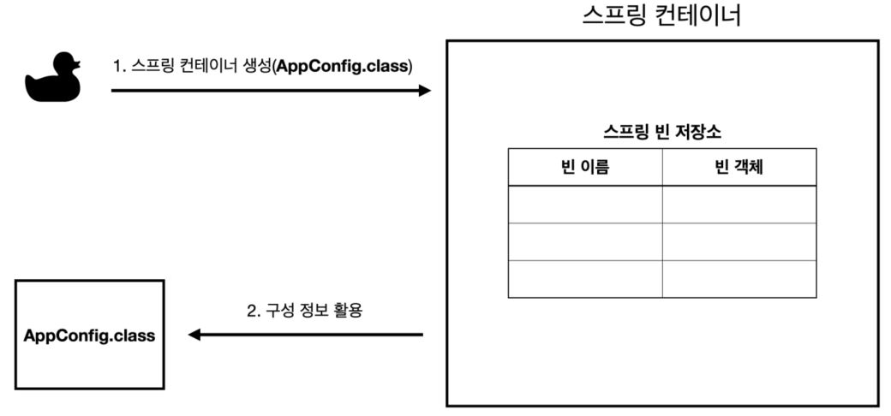

ApplicationContext applicationContext = new AnnotationConfigApplicationContext(AppConfig.class);

- ApplicationContext를 스프링 컨테이너라 한다.
- ApplicationContext는 인터페이스
- 스프링 컨테이너는 XML 기반으로 만들 수 있고, 애노테이션 기반의 자바 설정 클래스로 만들 수 있다.
- AppConfig를 사용했던 방식이 애노테이션 기반의 자바 설정 클래스로 스프핑 컨테이너를 만든 것이다.

## 스프링 컨테이너의 생성 과정

### 1.스프링 컨테이너 생성 

- new AnnotationConfigApplicationContext(AppConfig.class)
- 스프링 컨테이너를 생성할 때는 구성 정보를 지정해주어야 한다.
- 여기서는 AppConfig.class를 구성 정보를 지정했다.

